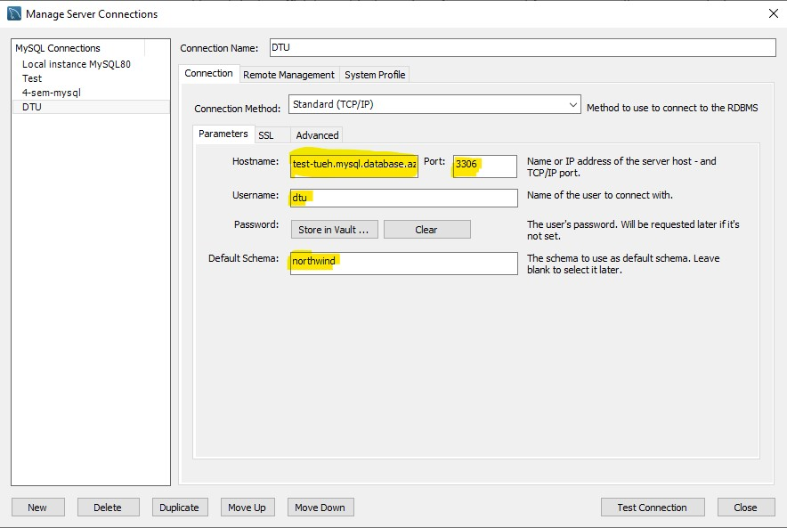
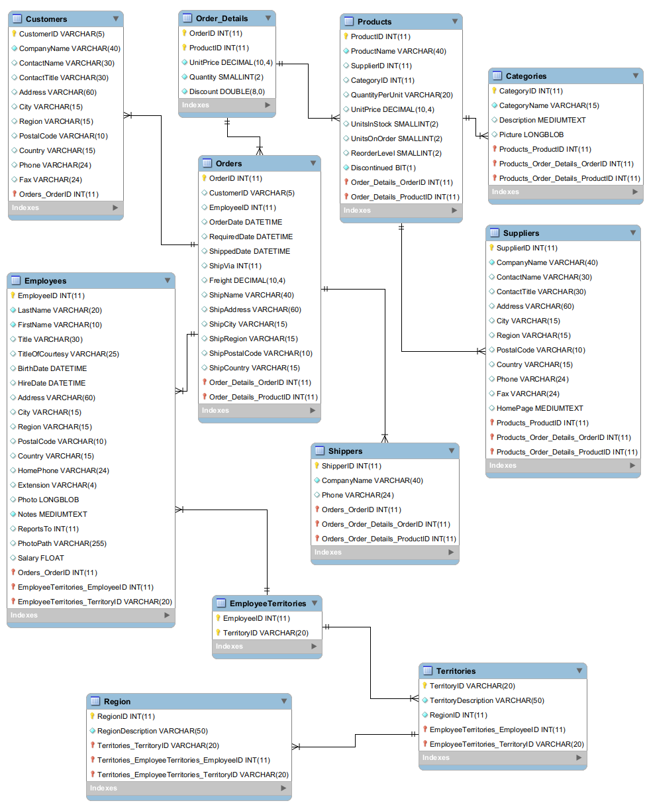

# Database
De data du kommer til at arbejde med vil i mange tilfælde ligge i en Database.

Du kan enten tilgå dem direkte eller ved at data er eksporteret ud af databasen, f.eks. som en eller flere CSV filer.

For at arbejde effektiv med data er det nødvendigt at forstå hvordan en database er opbygget - Hvordan de forskellige tabeller "hænger" sammen og hvordan man kan kombinere data fra flere forskellige tabeller.

## Database program
Det er databasen MySQL vi skal bruge og programmet MySQL Workbench.

[Download MySQL Workbench](https://dev.mysql.com/downloads/workbench/)

## Azure
I kommer til at arbejde med en MySQL database der er hostede på Azure i deres cloud løsning.

Fordelen ved det er at i ikke skal skal oprette databasen, tabeller og indsætte data. Det afspejler også godt de opgaver i kommer til at udfører senere, det vil være det færreste af jer der skal oprette en data base fra grunden.

### Login MySQL
I Workbench skal i oprette forbindelse til Azure databasen **Northwind**, med disse indstillinger:

- Server name: **test-tueh.mysql.database.azure.com**
- Login name: **dtu**
- Password: *udleveres i undervisningen*

## Northwind
*The Northwind database is a sample database used by Microsoft to demonstrate the features of some of its products, including SQL Server and Microsoft Access. The database contains the sales data for Northwind Traders, a fictitious specialty foods exportimport company.*

SQL script der opretter Northwind

### Northwind ER-diagram
E/R-diagrammer (Entitets/Relations-diagram) er et værktøj til at modellere databaser. 
E/R diagrammer viser alle entiteter i en database samt relationerne imellem dem. Informationerne herfra benyttes, når databasen oprettes.

