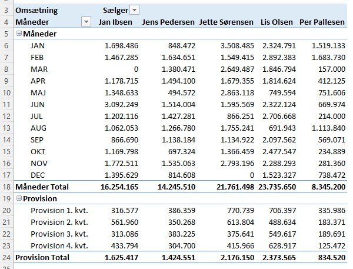
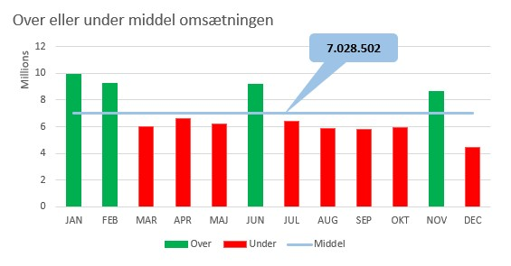

En **Pivot Tabel** er et meget effektivt værktøj til at *beregne*, *opsummere* og *analysere* data. En Pivot Tabel gør det muligt at se mønstre og tendenser i dine data.

### Microsoft
[PivotTabel](https://support.office.com/da-dk/article/oprette-en-pivottabel-for-at-analysere-regnearksdata-a9a84538-bfe9-40a9-a8e9-f99134456576?ui=da-DK&rs=da-DK&ad=DK)

## Salg pr. Medarbejder / Afdeling
*Hvad hvis du gerne vil se salget pr. medarbejder og slaget pr. afdeling?*

Svaret er  - **Opret en Pivot Tabel!**

Det er den tabel du lige har oprette der skal bruges som grundlag for de to Pivot Tabeller.

<iframe src="https://www.loom.com/embed/dd4093bb224c440295b07994fd4cadee" frameborder="0" webkitallowfullscreen mozallowfullscreen allowfullscreen style="position: absolute; top: 0; left: 0; width: 100%; height: 100%;"></iframe>

## PivotTabel Feltlisten
Når du har oprettet en pivottabel, får du vist feltlisten. Du kan ændre pivottabellens design ved at tilføje og arrangere dens felter. Hvis du vil sortere eller filtrere de kolonner med data, som vises i pivottabel, skal du se Sortere data i en pivottabel og Filtrere data i en pivottabel.

[Feltlisten](https://support.office.com/da-dk/article/brug-af-feltlisten-til-at-arrangere-felter-i-en-pivottabel-43980e05-a585-4fcd-bd91-80160adfebec)

## Gruppér data
Når du grupperer data i en pivottabel, kan det vise dig et undersæt af data, der skal analyseres.

[Gruppér eller opdel en gruppe af data i en pivottabel](https://support.office.com/da-dk/article/grupp%C3%A9r-eller-opdel-en-gruppe-af-data-i-en-pivottabel-c9d1ddd0-6580-47d1-82bc-c84a5a340725?ui=da-DK&rs=da-DK&ad=DK)

## Beregn værdier i en PivotTabel
I en pivottabel kan du bruge summeringsfunktioner i værdifelter til at kombinere værdier fra den underliggende datakilde. Hvis summeringsfunktioner og brugerdefinerede beregninger ikke giver de resultater, du ønsker, kan du oprette dine egne formler i beregnede felter eller beregnede elementer. Du kan f.eks. tilføje et beregnet element med formlen for salgsprovisioner, som kunne være forskellige fra område til område. Pivottabellen medtager derefter provisionen i subtotaler og hovedtotaler.

### Microsoft
[Beregn værdier i en pivottabel](https://support.office.com/da-dk/article/beregn-v%C3%A6rdier-i-en-pivottabel-11f41417-da80-435c-a5c6-b0185e59da77)

Det er muligt at oprette "*ekstra*" beregnede felter i en Pivot Tabel.

Mit eksempel er *Provision på 10%* ud fra hver medarbejderes salg, fordelt på kvartaler. Desuden er der fortaget en **gruppe** opdeling.

<iframe src="https://www.loom.com/embed/240adef6e8074344b1b905ede77cb1a9" frameborder="0" webkitallowfullscreen mozallowfullscreen allowfullscreen style="position: absolute; top: 0; left: 0; width: 100%; height: 100%;"></iframe>

## Middel omsætning
Jeg kunne godt tænke mig en et Pivot søjlediagram der viser følgende:

- Middel omsætningen
- Omsætning pr. mdr
- Om denne omsætning er over eller under middel

Til det vil jeg bruge en Pivot Tabel, ekstra data der udvider Pivot Tabellen og et diagram.

<iframe src="https://www.loom.com/embed/36bc487b77a3431089aaec6fedcb5948" frameborder="0" webkitallowfullscreen mozallowfullscreen allowfullscreen style="position: absolute; top: 0; left: 0; width: 100%; height: 100%;"></iframe>

## PivotDiagram
Nogle gange er det svært at se det store billede, når dine ubehandlede data ikke er blevet opsummeret. Din første Instinct kan være at oprette en pivottabel, men ikke alle kan se tal i en tabel og hurtigt se, hvad der foregår. Pivot Diagrammer er en god måde at føje datavisualiseringer til dine data.

## Opret Pivot Diagrammer
På basis af det to Pivot Tabeller, *Salg pr. Medarbejder* og *Salg i pct. pr. afdeling* skal der oprettes to Pivot Diagrammer.

<iframe src="https://www.loom.com/embed/08eeed1ce87e4b7e9f500782bc7983b0" frameborder="0" webkitallowfullscreen mozallowfullscreen allowfullscreen style="position: absolute; top: 0; left: 0; width: 100%; height: 100%;"></iframe>

### Microsoft
[PivotDiagram](https://support.office.com/da-dk/article/opret-et-pivotdiagram-c1b1e057-6990-4c38-b52b-8255538e7b1c)

## Slette en PivotTabel
Når du ikke længere har brug for en pivottabel, skal du markere hele pivottabellen og trykke på Delete for at fjerne den.

[Slet PivotTabel](https://support.office.com/da-dk/article/slette-en-pivottabel-1de9b894-9178-43b3-b436-92e3ddb9175b)

## PivotTabel Tidslinje
I stedet for at justere filtre for at få vist datoer kan du bruge en tidslinje i en pivottabel – en dynamisk filtreringsindstilling, hvor du kan nemt kan filtrere efter dato/klokkeslæt og zoome ind på det ønskede tidsrum ved hjælp af et *skyderkontrolelement*. Klik på Analysér > Indsæt en Tidslinje for at indsætte en på regnearket.

[PivotTabel Tidslinje](https://support.office.com/da-dk/article/opret-en-pivottabel-tidslinje-til-at-filtrere-datoer-d3956083-01be-408c-906d-6fc99d9fadfa)

## Slicer
En *Slicer* gør det nemt for brugeren at udvælge/filtrer de data man vil se. En *Slicer* viser også brugeren den aktuelle filtrerings tilstand, hvilket gør det nemt at forstå, hvad der vises.

<iframe src="https://www.loom.com/embed/04743cdafb1142c3ba9859f5b0e21dab" frameborder="0" webkitallowfullscreen mozallowfullscreen allowfullscreen style="position: absolute; top: 0; left: 0; width: 100%; height: 100%;"></iframe>

### Microsoft
[Slicer - Microsoft US](https://support.microsoft.com/en-us/office/use-slicers-to-filter-data-249f966b-a9d5-4b0f-b31a-12651785d29d)

## Timeline
I stedet for at justere filtre for at få vist datoer kan du bruge en tidslinje i en pivottabel – en dynamisk filtrerings indstilling, hvor du kan nemt kan filtrere efter dato/klokkeslæt og zoome ind på det ønskede tidsrum ved hjælp af et *skyder kontrol element*. 

Klik på **Analysér** > Indsæt en Tidslinje for at indsætte en på regnearket.

<iframe src="https://www.loom.com/embed/78a7fae0e21a422688c008cbc329fc65" frameborder="0" webkitallowfullscreen mozallowfullscreen allowfullscreen style="position: absolute; top: 0; left: 0; width: 100%; height: 100%;"></iframe>

### Microsoft
- [PivotTabel Tidslinje - Microsoft DK](https://support.office.com/da-dk/article/opret-en-pivottabel-tidslinje-til-at-filtrere-datoer-d3956083-01be-408c-906d-6fc99d9fadfa)
- [PivotTabel Tidslinje - Microsoft US](https://support.microsoft.com/en-us/office/create-a-pivottable-timeline-to-filter-dates-d3956083-01be-408c-906d-6fc99d9fadfa)

