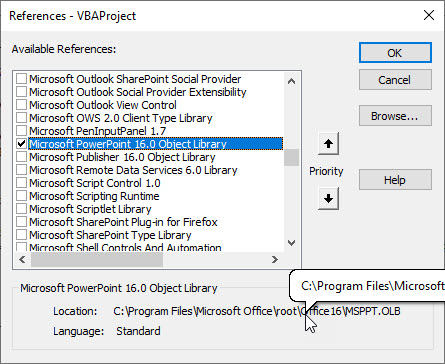

Når du har oprette diagrammer i Excel er det tit fordi de skal bruges i en PowerPoint præsentation. Hvis det er noget du til opdatere og så skal oprette en ny PowerPoint kunne det være en fordel med en makro.

## References - PowerPoint
Når du skal have adgang til VBA i et andet Office program - i dette tilfælde PowerPoint - skal du oprette en Reference til dette programs objeckt model.

Dette gøres på følgende måde:

- I VBA - klik på **Tools**
- Vælg **References**
- Find **Microsoft PowerPoint XX Object Library** - *I dette tilfælde er det nummer 15.0, men det vil ændre sig med versionen af Office.*
- Klik **Ok**



Hvis denne reference ikke er på plads vil kode ikke virke, da det ikke er muligt at bruge PowerPoint VBA.

<div style="position: relative; padding-bottom: 105.21920668058455%; height: 0;"><iframe src="https://www.loom.com/embed/352ea7958e8842b9a68f0e69c9745b64" frameborder="0" webkitallowfullscreen mozallowfullscreen allowfullscreen style="position: absolute; top: 0; left: 0; width: 100%; height: 100%;"></iframe></div>

## Åben PowerPoint

```vbnet
Sub AabenPowerPoint()
    ' Variable
    Dim appPowerPoint As Object

    ' Åben PowerPoint
    Set appPowerPoint = CreateObject("PowerPoint.Application")
    
    ' Handlinger i PowerPoint
    With appPowerPoint
        .Visible = True
        .Presentations.Add
        .ActivePresentation.Slides.Add 1, 1
    End With

End Sub
```

[Slide.Layout property (PowerPoint)](https://docs.microsoft.com/en-us/office/vba/api/powerpoint.slide.layout)

## Åben eksisterende præsentation
Hvis du har en PowerPoint præsentation du vil åbne, kan du gøre det på denne måde.  
Bemærk at du skal angive stien og filnavnet i variablen *PowerPointPress*

```vb
Sub AabenPowerPointPresentation()
    ' Variable
    Dim appPowerPoint As Object
    Dim PowerPointPress As String

    ' Eksisterende PowerPoint præsentation
    PowerPointPress = "C:\Users\Tue Hellstern\Documents\Salgsdata.pptx"
    
    ' Åben PowerPoint
    Set appPowerPoint = CreateObject("PowerPoint.Application")
    
    ' Handlinger i PowerPoint
    With appPowerPoint
        .Visible = True
        .Presentations.Open (PowerPointPress)
    End With

End Sub
```


## Kode - Diagram til PowerPoint
Her er koden til at overføre diagrammer til PowerPoint

```vb
Sub Overfor_til_PowerPoint()
    ' Variabler
    Dim pptApp As PowerPoint.Application
    Dim pptPres As PowerPoint.Presentation
    Dim pptSlide As PowerPoint.Slide
    
    Dim pptSlideCount As Integer ' Antal Slides
    Dim cht As Excel.ChartObject ' Excel diagram
    
    ' Vælg ark
    PowerPointArk.Select
    
    ' Åben PowerPoint
    Set pptApp = New PowerPoint.Application ' Åben applikationen PowerPoint
    Set pptPres = pptApp.Presentations.Add  ' Tilføj en præsentation
    
    
    ' Find alle Diagrammer i det aktive sheet
    For Each cht In ActiveSheet.ChartObjects
    
        ' Slide
        pptSlideCount = pptPres.Slides.Count ' Antal slide i præsentationen
        Set pptSlide = pptPres.Slides.Add(pptSlideCount + 1, ppLayoutBlank) ' Blankt slide
    
        ' Diagram
        cht.Select ' Vælg diagram
        ActiveChart.ChartArea.Copy ' Kopi af slide
        pptSlide.Shapes.PasteSpecial (ppPasteJPG) ' Indsæt slide i PowerPoint
        
        ' Tilpasning af diagram
        With pptApp.ActiveWindow.Selection.ShapeRange
            .Height = Application.CentimetersToPoints(12)
            .Width = Application.CentimetersToPoints(20)
            .Left = Application.CentimetersToPoints(7)
            .Top = Application.CentimetersToPoints(3)
        End With
    
    Next
    
    ' Luk / Gem
    pptPres.SaveAs Application.ActiveWorkbook.Path & "\salgsdiagrammer.pptx"
    
    pptPres.Close
    pptApp.Quit
    
End Sub
```