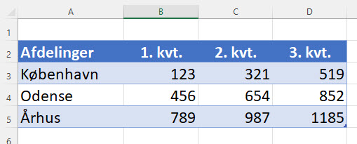
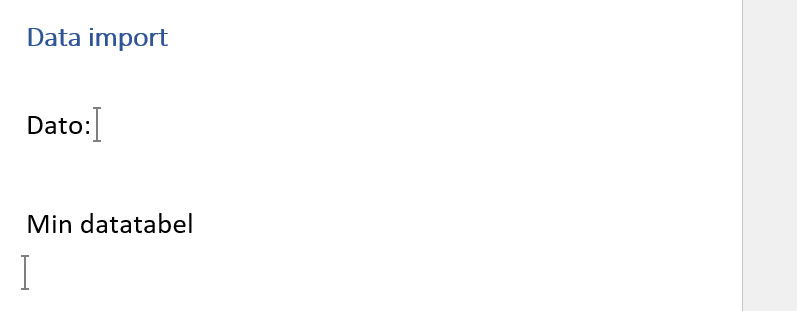

Det kan være en fordel at bruge Word til oprettelse af rapporter og lign.

Denne VBA kode vil virke uanset hvilken Word version du brugere og uden yderligere referencer, hvilket er en stor fordel når du opgradere til en ny Office version.

```vbnet
Sub AabenWord()
    ' Variable
    Dim appWord As Object
    
    ' Åben Word
    Set appWord = CreateObject(Class:="Word.Application")

    ' Handlinger i Word
    With appWord
        .Visible = True ' Vis Word
        .Documents.Add  ' Nyt dokument
    End With

    ' Oprydning
    Set appWord = Nothing

End Sub
```

#### Åben eksisterende dokument
Brug denne VBA kode til at åbne et eksisterende Word dokument.  
Bemærk at du skal angive stien og filnavnet i variablen *WordFilePath*

```vbnet
Sub AabenWordDokument()
    ' Variable
    Dim appWord As Object
    Dim WordFilePath As String
    
    ' Åben Word
    Set appWord = CreateObject(Class:="Word.Application")
    
    ' Sti og filnavn på det dokument der skal åbnes
    WordFilePath = "C:\Users\Tue Hellstern\Documents\SalgsBudget.docx"

    ' Handlinger i Word
    With appWord
        .Visible = True
        .Documents.Open Filename:=WordFilePath
    End With
    
    ' Oprydning
    Set appWord = Nothing
    
End Sub
```
Du kan læse mere om de muligheder der er i *Documents.Open* metoden her:  
[Documents.Open method (Word)](https://docs.microsoft.com/en-us/office/vba/api/word.documents.open)

#### Kopier Excel tabel til Word
Eksempel på hvordan du kopiere en Excel tabel til Word. Tabellen har navnet: *SalgsData*.

```vbnet
Sub TabelWordDokument()
    ' Variable
    Dim appWord As Object
    Dim tbl As Excel.Range
    Dim WordTable As Object
    Dim WordFilePath As String
    
    ' Åben Word
    Set appWord = CreateObject(Class:="Word.Application")
    
    ' Sti og filnavn på det dokument der skal åbnes
    WordFilePath = "C:\xxx\yyy\zzz\SalgsBudget.docx"
    
    ' Tabellen der skal kopieres
    Set tbl = ThisWorkbook.Worksheets(1).ListObjects("SalgsData").Range
    tbl.Copy

    ' Handlinger i Word
    With appWord
        .Visible = True
        .Documents.Open Filename:=WordFilePath
        .Selection.PasteExcelTable _
            LinkedToExcel:=False, WordFormatting:=False, RTF:=False ' Indsæt Excel tabel
        .ActiveDocument.Tables(1).AutoFitBehavior 1 ' wdAutoFitWindow = 1
    End With

    ' Oprydning
    Set appWord = Nothing
    Application.CutCopyMode = False
    
End Sub
```

- [Selection.PasteExcelTable method (Word)](https://docs.microsoft.com/en-us/office/vba/api/word.selection.pasteexceltable)
- [WdAutoFitBehavior Enum](https://docs.microsoft.com/en-us/dotnet/api/microsoft.office.interop.word.wdautofitbehavior?view=word-pia)

# Eksempel ovf. Tabel data til Word
Vi har en Tabel i Excel der skal overføres til Word, da det er noget vi skal gøre hver gang data i Excel bliver opdateret vil vi gerne gøre det via en makro.



Denne tabel skal over i et Word dokument, **DataImport.dotx**, dette Word dokument indeholder lidt tekst og 2 "*Bogmærker*" (*Bookmark*)

- bmkDato
- bmkDataTabel



Jeg forudsætter at Excel filen og Word dokumentet er i den **sammen mappe**.

## Video
**Video 1** - Variabler - Ref til Word
<div style="position: relative; padding-bottom: 108.35073068893529%; height: 0;"><iframe src="https://www.loom.com/embed/3dd1185b512d4aec91c10c04fbc03376" frameborder="0" webkitallowfullscreen mozallowfullscreen allowfullscreen style="position: absolute; top: 0; left: 0; width: 100%; height: 100%;"></iframe></div>

**Video 2** - Start af Word
<div style="position: relative; padding-bottom: 106.10526315789474%; height: 0;"><iframe src="https://www.loom.com/embed/be82012b8cbf4aae9949f12a539f1d2e" frameborder="0" webkitallowfullscreen mozallowfullscreen allowfullscreen style="position: absolute; top: 0; left: 0; width: 100%; height: 100%;"></iframe></div>

**Video 3** - Indsæt dags dato i Word
<div style="position: relative; padding-bottom: 106.10526315789474%; height: 0;"><iframe src="https://www.loom.com/embed/e4533dc712b6445abd2196cc9f729281" frameborder="0" webkitallowfullscreen mozallowfullscreen allowfullscreen style="position: absolute; top: 0; left: 0; width: 100%; height: 100%;"></iframe></div>

**Video 4** - Indsæt tabellen i Word
<div style="position: relative; padding-bottom: 106.10526315789474%; height: 0;"><iframe src="https://www.loom.com/embed/f214a07208164fb69447a4b6df2ff748" frameborder="0" webkitallowfullscreen mozallowfullscreen allowfullscreen style="position: absolute; top: 0; left: 0; width: 100%; height: 100%;"></iframe></div>

**Video 5** - Luk Word objektet
<div style="position: relative; padding-bottom: 106.10526315789474%; height: 0;"><iframe src="https://www.loom.com/embed/755b778be973490192580d0f150412a5" frameborder="0" webkitallowfullscreen mozallowfullscreen allowfullscreen style="position: absolute; top: 0; left: 0; width: 100%; height: 100%;"></iframe></div>


## VBA koden

```vb
Sub Export_Word()
    ' Variabler
    ' Navn på Word dokument
    Const strWordDokument As String = "DataImport.dotx"
    
    ' Word object
    Dim wdApp As Word.Application
    Dim wdDoc As Word.Document
    Dim wdBmkRange As Word.Range
    
    ' Excel object
    Dim wbBook As Workbook
    Dim wbSheet As Worksheet
    Dim ranRapport As Range
    
    Set wbBook = ThisWorkbook ' Den aktive fil
    Set wbSheet = wbBook.Worksheets("Tabel_OmsAfd") ' ref til ark
    Set ranRapport = wbSheet.Range("OmsAfd") ' Ref. til tabellen - Tabel_OmsAfd
    
    ' Start Word
    Set wdApp = New Word.Application ' Word app
    Set wdDoc = wdApp.Documents.Open(wbBook.Path & "\" & strWordDokument) ' Åben Word doc
    
    ' Indsæt dato
    Set wdBmkRange = wdDoc.Bookmarks("bmkDato").Range ' Bogmærke: bmkDato
    wdBmkRange.InsertAfter Date
    
    ' Indsæt tabellen
    Set wdBmkRange = wdDoc.Bookmarks("bmkDataTabel").Range ' Bogmærke: bmkDataTabel
    
    ' Kopi af tabellen: OmsAfd
    ranRapport.Copy
    
    With wdBmkRange
        .Select ' Vælg boogmærket
        .PasteSpecial Link:=False, _
            DataType:=wdPasteMetafilePicture, _
            Placement:=wdInLine, _
            DisplayAsIcon:=False ' Indsæt Tabellen som et billede, ingen link
    End With
    
    ' Luk
    With wdDoc
        .SaveAs2 wbBook.Path & "\Word_Rapport_" & Format(Date, "dd_mm_yyyy") & ".docx", _
            FileFormat:=wdFormatDocumentDefault
        .Close ' Luk Dokument
    End With

    wdApp.Quit ' Luk word
    
End Sub
```